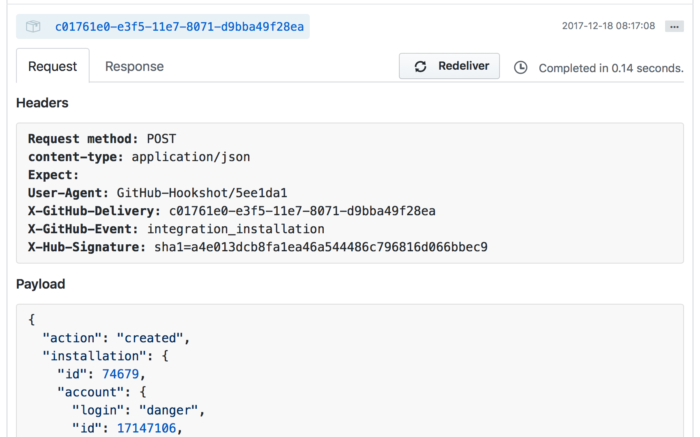

## References

* <https://github.com/danger/peril-settings>
* <https://github.com/artsy/artsy-danger>
* <https://github.com/CocoaPods/peril-settings>

# Config JSON

**@see** - [Introducing Peril to the Artsy Org](http://artsy.github.io/blog/2017/09/04/Introducing-Peril/)

Let's deep dive into the JSON:

```
{
  "settings": {
    [your settings]
  },
  "rules": {
    "pull_request": "orta/peril-bootstrap@dangerfiles/pr.js",
    "issues": "orta/peril-bootstrap@dangerfiles/issue.js"
  },
  "repos" : {
    "orta/ORStackView": {
      "issue.created": "lock_old_issues.ts"
    }
  }
}
```

### `settings`

**@see** -
[source/db/GitHubRepoSettings.ts](https://github.com/danger/peril/blob/master/source/db/GitHubRepoSettings.ts)

I'm hesitant to add the specific settings which are supported inside this document, as it'll always end up out of date.

The source code above should be a reasonable read.

### `rules`

**@see** - [source/db/index.ts](https://github.com/danger/peril/blob/master/source/db/index.ts)

These are globally applied rules, e.g. to every repo. It's a set of `event names`, to `dangerfiles`.

#### Event Names

These are the names of a webhook from GitHub. A webhook event always has a name, but it may also have an action.

For example, when you set up Peril, you'll have recieved this webhook:



It has an event of `integration_installation` and an action of `created`. The keys in the rules section allow you to
write dangerfiles which only run against either a specific action, or against all of them.

You can get information about _any_ webhook
[action/names in the GitHub docs](https://developer.github.com/v3/activity/events/types/).

For a Pull Request, there are
[a lot of actions](https://developer.github.com/v3/activity/events/types/#pullrequestevent): It can be one of
`assigned`, `unassigned`, `review_requested`, `review_request_removed`, `labeled`, `unlabeled`, `opened`, `edited`,
`closed`, or `reopened`.

You can specify a Dangerfile to run either on **all** events by using `"pull_request"` or only a specific action on a
pull request with `"pull_request.[action]"`.

For example:

```
{
  "rules": {
    "pull_request": "...", // all
    "pull_request.assigned": "...", // only on when a PR has someone assigned
    "pull_request.closed": "...",// only on when a PR is closed
    ...
  }
}
```

### `dangerfiles`

The value in these keys is a reference to a Dangerfile. There are two ways of specifying a Dangerfile, remote or local.

* Remote references are Dangerfiles that do not live on the repo from which the event came.
* Local references come from the same repo as the event.

For Dangerfiles which run on many repos, you probably want to use a remote reference. It would look something like:

* `repo/slug@path/to/dangerfile.js` - _in abstract_
* `artsy/artsy-danger@org/closed-prs.ts`- _in concrete_

For a Dangerfile which exists on the repo your running events from, you can use a local reference

* `path/to/dangerfile.js`

You can also append `#branch` to the end of a string to select a branch to run from.

I'd like to add a way to indicate nullability being OK at some point, e.g. `path/to/dangerfile.js?` - however for now
you will get an error message if the dangerfile does not exist.

### `repos`

Rules are for every repo, `repos` are rules for a single repo.

```json
{
  "rules": {
    "pull_request": "artsy/artsy-danger@org/all-prs.ts",
    "pull_request.closed": "artsy/artsy-danger@org/closed-prs.ts"
  },
  "repos": {
    "artsy/reaction": {
      "pull_request": "danger/pr.ts"
    },
    "artsy/positron": {
      "pull_request": ["dangerfile.ts", "check-for-assignee.ts"]
      ]
    },
  }
```

So, let's say a PR is closed on `artsy/reaction`, it would trigger three Dangerfiles to run:

* `"artsy/artsy-danger@org/all-prs.ts"`
* `"artsy/artsy-danger@org/closed-prs.ts"`
* `"danger/pr.ts"` - _this comes from artsy/reaction_

If a PR were `edited` or `opened`, it would trigger two dangerfiles:

* `"artsy/artsy-danger@org/all-prs.ts"`
* `"danger/pr.ts"` - _this comes from artsy/reaction_

I'm not sure the order in which they're ran, so don't rely on that. You can also use an array to execute a set of
dangerfiles instead of making a single mega-file.

# Writing a Dangerfile

You can write your Dangerfiles in JavaScript or TypeScript. It will be transpiled with these settings:

* [tsconfig.json](https://github.com/danger/peril/blob/master/tsconfig.json)
* [.babelrc](https://github.com/danger/peril/blob/master/.babelrc)

These are not set in stone. You're welcome to improve them.

### PR vs Event

There are two types of Dangerfile runs.

* _PR_ runs, which are related to PR events. This is the normal DSL in the
  [Danger JS Reference](http://danger.systems/js/reference.html)
* _Event_ runs, which are anything other than PR events. In these cases the `github` instance in the DSL is replaced
  with the JSON that came in from the event.

Not all events have something they can comment on, only `pull_request` and `issues`. So `fail`, `warn`, `markdown` and
`message` won't work. In practice we've used a slack webhook to pass information back to our dev channel. It's just
JavaScript, so you can use any module you want.

### Scheduler

Scheduled tasks to run using a cron-like syntax.

This uses [node-schedule](https://github.com/node-schedule/node-schedule) under the hood. The object is similar to the
rules section, in that you define a cron-string with the following format:

```
    *    *    *    *    *    *
    ┬    ┬    ┬    ┬    ┬    ┬
    │    │    │    │    │    |
    │    │    │    │    │    └ day of week (0 - 7) (0 or 7 is Sun)
    │    │    │    │    └───── month (1 - 12)
    │    │    │    └────────── day of month (1 - 31)
    │    │    └─────────────── hour (0 - 23)
    │    └──────────────────── minute (0 - 59)
    └───────────────────────── second (0 - 59, OPTIONAL)
```

Which, inside the Peril settings, would look something like:

```json
    "scheduler": {
      "0 0 12 * * ?": "schedule/daily_at_twelve.ts",
      "0 9 * * 1-5": "schedule/weekday_wakeup_email.ts"
    }
```

There's a lot of great resources on the net showing the general syntax for the cron format.

### Tasks

If you have Peril hooked up to a Mongo DB instance (via the ENV var `MONGODB_URI` (there's a free heroku add-on which
works with no config)) then you can schedule jobs to run in the future. An example of this is in the Artsy peril, where
creating an RFC issue will send notifications for a few days into our slack.

This works by defining tasks in your `peril.settings.json`:

```json
  "tasks": {
    "slack-dev-channel": "artsy/artsy-danger@tasks/slack-dev-channel.ts"
  },
```

Which maps a task name to a file in a repo. You schedule tasks using the Peril object inside a Dangerfile:

```ts
import { danger, peril } from "danger"
import { Issues } from "github-webhook-event-types"

const gh = (danger.github as any) as Issues
const issue = gh.issue

const slackify = (text: string) => ({})

if (issue.title.includes("RFC:") || issue.title.includes("[RFC]")) {
  peril.runTask("slack-dev-channel", "in 5 minutes", slackify("🎉: A new RFC has been published."))
  peril.runTask("slack-dev-channel", "in 3 days", slackify("🕰: A new RFC was published 3 days ago."))
  peril.runTask("slack-dev-channel", "in 7 days", slackify("🕰: A new RFC is ready to be resolved."))
}
```

This schedules three jobs using [agenda](https://github.com/agenda/agenda) under the hood. The params are a task name, a
strings based on [human-interval](https://github.com/agenda/human-interval), then data which will be passed through to
your job later.

When your task starts running, you can access that data via `peril.data`:

```ts
import { peril } from "danger"
import { IncomingWebhook } from "@slack/client"

const url = peril.env.SLACK_RFC_WEBHOOK_URL || ""
const webhook = new IncomingWebhook(url)
webhook.send(peril.data)
```

### Types

If you're writing in TypeScript, I have [a node module](https://github.com/orta/github-webhook-event-types) that just
contains the types of all the events. This is really useful in an event run.

For example, this is a Dangerfile for an issue event:

```ts
import { schedule, danger } from "danger"
import { IncomingWebhook } from "@slack/client"
import { Issues } from "github-webhook-event-types"

declare const peril: any // danger/danger#351
const gh = (danger.github as any) as Issues
const issue = gh.issue

if (issue.title.includes("RFC:")) {
  var url = peril.env.SLACK_RFC_WEBHOOK_URL || ""
  var webhook = new IncomingWebhook(url)
  schedule(async () => {
    await webhook.send({
      unfurl_links: false,
      attachments: [
        {
          pretext: "🎉 A new Peril RFC has been published.",
          color: "good",
          title: issue.title,
          title_link: issue.html_url,
          author_name: issue.user.login,
          author_icon: issue.user.avatar_url,
        },
      ],
    })
  })
}
```

### Known limitations

* You cannot do a relative import of a JS file
* Async work needs to be `schedule`'d - rather than relying on the node process to handle all async work

# Writing Tests for your Dangerfile

In the Artsy Peril config repo, we runs tests for each new rules in isolation. This is done with a small amount of
trickery. By adding this to the top of your Dangerfile, then making each rule live inside an async `rfc` function.

```ts
const isJest = typeof jest !== "undefined"

// Stores the parameter in a closure that can be invoked in tests.
const storeRFC = (reason: string, closure: () => void | Promise<any>) =>
  // We return a closure here so that the (promise is resolved|closure is invoked)
  // during test time and not when we call rfc().
  () => (closure instanceof Promise ? closure : Promise.resolve(closure()))

// Either schedules the promise for execution via Danger, or invokes closure.
const runRFC = (reason: string, closure: () => void | Promise<any>) =>
  closure instanceof Promise ? schedule(closure) : closure()

const rfc: any = isJest ? storeRFC : runRFC
```

So, a rule to check for a assignee would be something that Jest (which doesn't have the issue around local
import/exports) could import the function.

```js
// https://github.com/artsy/artsy-danger/issues/5
export const rfc5 = rfc("No PR is too small to warrant a paragraph or two of summary", () => {
  const pr = danger.github.pr
  if (pr.body === null || pr.body.length === 0) {
    fail("Please add a description to your PR.")
  }
})
```

Then you can mock `danger` as an import and use any sort of mocked data you want.

```js
jest.mock("danger", () => jest.fn())
import * as danger from "danger"
const dm = danger as any

import { rfc5 } from "../org/all-prs"

beforeEach(() => {
  dm.fail = jest.fn()
})

it("fails when there's no PR body", () => {
  dm.danger = { github: { pr: { body: "" } } }
  return rfc5().then(() => {
    expect(dm.fail).toHaveBeenCalledWith("Please add a description to your PR.")
  })
})

it("does nothing when there's a PR body", () => {
  dm.danger = { github: { pr: { body: "Hello world" } } }
  return rfc5().then(() => {
    expect(dm.fail).not.toHaveBeenCalled()
  })
})
```
