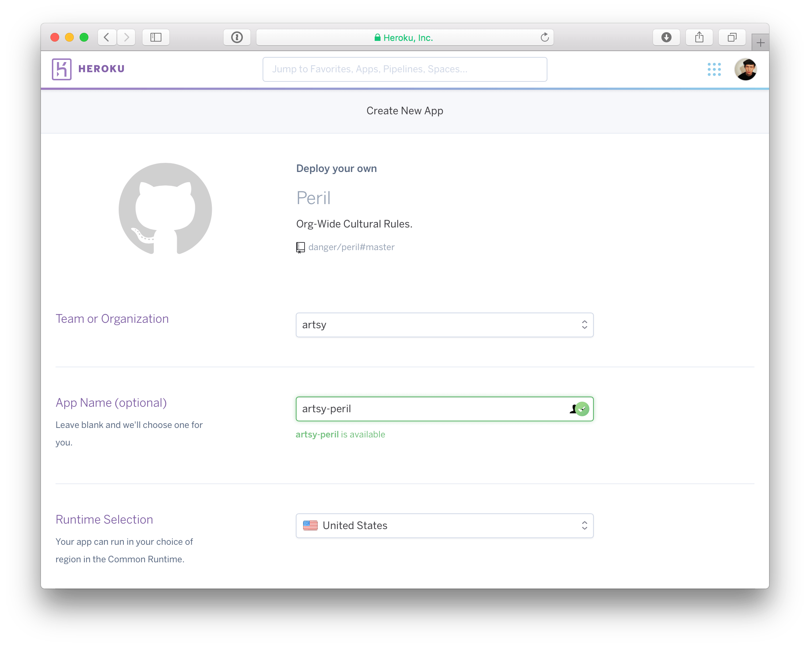

### Setting up a Peril server

This doc is for Peril who want to self-host. I'm using Heroku as the example, but it will work with most process-level
server abstraction, e.g. next (which Peril Staging works with) or anything which can run a server from a Docker
container.

> Sidenote: here's a note with [terminology](./terminology.md) as it's a little tricky.

So, you will need to have:

- A heroku instance for Peril
- A unique GitHub App
- A repo where you can keep Peril settings

## Creating your GitHub App

To create this, go to the URL (with your org):

> <https://github.com/organizations/[my_org]/settings/apps>

or

> https://github.com/settings/apps (for adding it to a user)

Then create a new app (use `peril-[my-org]`, there is a global namespace for GitHub apps.)

You will need to give it a homepage (anything) and a webhook url. For the webhook url use something like:

> `https://[my_app_name].herokuapp.com/webhook`

e.g. `https://peril-artsy.herokuapp.com/webhook`

You should also create a secret, this is just some text that Peril will use to confirm that GitHub is the entity sending
you webhooks. It can be any string, so long as it's the same in the heroku setup also.

With respect to **permissions**, my recommendations are:

- `Checks: Read & Write` - _Peril comments on PRs via the Checks API_
- `Repo Metadata: Read` - _no option on this one_
- `Repository contents: Read` - _Let Peril read your code_
- `Issues: Read & Write` - _let Peril see/amend new issues_
- `Pull Requests: Read & Write` - _let Peril act on prs_
- `Commit Statuses: Read & Write` - _let Peril provide green/red status indicators_

And if you want to run Peril only for org members: `Organization Members: Read`. Note: it's trivial to go and change
these later as you think of more rules that need different events.

With respect to **webhooks**, my recommendations are:

- `Issues`
- `Pull Request`

At the bottom is the option to only allow this integration to run on your org, you want this ticked probably.

Once this is created, generate and download the App's GitHub signing key and keep track of the numerical ID (in the
About section), you'll need this later.

## Installing the App

Now that you have created the GitHub app, you need to install it onto your GitHub account/org. On the app's page in
github there is a sidebar which should have a link "Install App" - click that.

It'll show a list of potential places to install, which may just be your org. Click install for your org. Here you can
choose either:

- install on all repos
- install on a few repos

Either is fine, for very large orgs, I'd start with a few repos, get it stable then move to all.

Completing this gives you the installation ID in the URL, grab this, you'll need it later:

> `https://github.com/organizations/[my_org]/settings/installations/74679`

## Heroku

Ok, so, you need a heroku account. So sign up if you've not. This post will wait for you.

Click:
[](https://heroku.com/deploy?template=https://github.com/danger/peril)
. It's the "auto-heroku-ize" button that will walk you through setting up the environment variables for running Danger
for just one org.

It should take you to a page like this:



You need to go through adding the environment variables. The `app.json` is self-documenting about the variables that
need to be set.

One of them, `DATABASE_JSON_FILE` will require you to create your config repo.

## Config Repo

You need to have a repo which Peril has access to. This repo needs to have a settings JSON file. For now, here's an
example JSON file which runs some Dangerfiles:

```json
{
  "settings": {
    [your settings]
  },
  "rules": {
    "pull_request": "orta/peril-bootstrap@dangerfiles/pr.js",
    "issues": "orta/peril-bootstrap@dangerfiles/issue.js"
  },
  "repos" : {
    "orta/ORStackView": {
      "issues.opened": "lock_old_issues.ts"
    }
  }
}
```

You can look at the both the [pull_request](https://github.com/orta/peril-bootstrap/blob/master/dangerfiles/pr.js) and
[issue](https://github.com/orta/peril-bootstrap/blob/master/dangerfiles/issue.js), to verify there are no
[shenanigans](https://www.merriam-webster.com/dictionary/shenanigan).

This JSON file is split into 3 parts:

- Settings for Peril
- Rules for the organization
- Rules per repo

This setup will:

- Listen for the event `"pull_request"`, and will pull `"dangerfiles/pr.js"` from the repo: `orta/peril-bootstrap`.
- Listen for the event `"issues"`, and will pull `"dangerfiles/issue.js"` from the repo: `orta/peril-bootstrap`.
- Listen for the event `"issues"` event, and only if the action is `"opened"` and will pull `"lock_old_issues.ts"` from
  the same repo: `orta/ORStackView`. So it would ignore issue updates or deletes.

You can actually use `orta/example-peril` BTW, I have some dummy Dangerfiles on that repo exactly for this purpose. Save
the above JSON as `peril-settings.json`. Add that to a repo, push it to master on your GitHub remote. Here's one
[I did earlier](https://github.com/artsy/peril-settings/commit/03a1745b1f9f83fc2367ed6cdc72dee3f466b75f).

Note: when you make updates to this file, you need to restart your Peril server, until
[#88](https://github.com/danger/peril/issues/88) is resolved.

# What now?

### Write your own org Dangerfiles

Read: [Settings Repo Info](settings_repo_info.md).

Inside your repo create a new file for your first Dangerfile. Maybe have something like:

```js
import { warn, danger } from "danger"
// Add a check to see if a changelog exists, then warn if it isn't in modified etc
```

### Compare against known settings repos

- <https://github.com/danger/peril-settings>
- <https://github.com/artsy/peril-settings>
- <https://github.com/CocoaPods/peril-settings>
- <https://github.com/Moya/moya-peril>
- <https://github.com/RxSwiftCommunity/peril>
- <https://github.com/ashfurrow/peril-settings> (personal repo)
- <https://github.com/orta/peril-settings> (personal repo)

(Note: Peril can technically be installed on personal accounts, too, because an account is just a specific type of org
from the GitHub API's perspective.)

# Troubleshooting

### Check your logs

Run `heroku logs --app [my_heroku_peril_app]`.

### "You need an installation ID for your integration: `PERIL_ORG_INSTALLATION_ID`

Go back to your integration settings, you _probably_ have two events so far. The 2nd one, which has a
`X-GitHub-Event: integration_installation` will provide you with the env var for `PERIL_ORG_INSTALLATION_ID`. You can
find the installation id inside "installation.id" in the JSON. To set the heroku env var, run
`heroku config:add PERIL_ORG_INSTALLATION_ID="[my-id]" --app [my_heroku_peril_app]`

Setting it will restart the server.

### Peril isn't editing it's own messages: `PERIL_BOT_USER_ID`

The GitHub API doesn't let the bot know what it's user ID is yet, so you'll need to pull this out of the API, sorry.
Find an issue/PR where Peril has commented, then you need to see the API request for that issue/PR. For both issues and
PRs, you use a URL like

> `https://api.github.com/repos/[org]/[repo]/issues/[pr_or_issue_id]/comments`

Check [Github API docs](https://developer.github.com/v3/issues/comments/#list-comments-on-an-issue) or
[here](https://platform.github.community/t/obtaining-the-id-of-the-bot-user/2076/5) if you need more info on how to
perform the request or [here](https://developer.github.com/v3/auth/#basic-authentication) if you are having trouble
authenticating.

Then you can scroll down on the API JSON response to find the `"user"."id"` of the Peril user account. It will be a
comment where the `"user"."type"` value is `"Bot"`.

Set this on your server using: `heroku config:add PERIL_BOT_USER_ID="[bot-id]" --app [my_heroku_peril_app]`.

### Peril crashed, so I changed something and want to run the same event

Inside the Integration settings under Advanced, you can get a list of all events sent to Peril. You can open one of
them, and then click on "Redeliver" to send it again.
