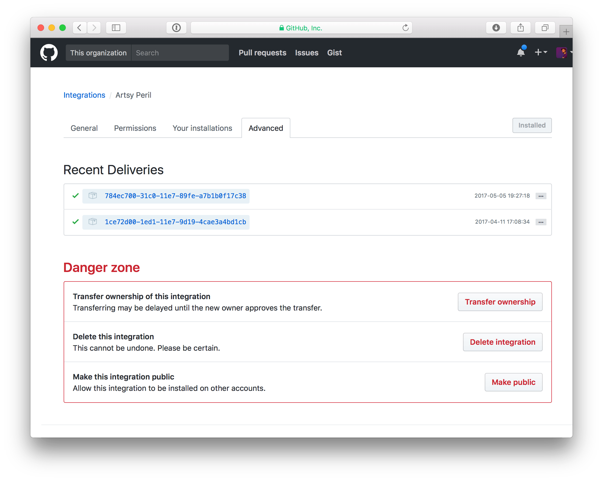

### Setting up a Peril server

I'm assuming you're going to use heroku. Peril is set up for being used in Docker, but it'll require a bit of time before _I'm_ confident using it myself, and thus writing tutorials for it.

> Sidenote: here's a note with [terminology](./terminology.md) as it's a little tricky.

So, you will need to have:

-   A unique GitHub Integration
-   A repo where you can keep Peril settings
-   A heroku instance for Peril

## Creating your GitHub App

You would go to the URL (with your org): 

> <https://github.com/organizations/[my_org]/settings/apps>

Then create a new app (use `peril-[my-org]`, there is a global namespace for GitHub apps.) At the bottom is the option to only allow this integration to run on your org, you want this ticked probably.

With respect to permissions, my recommendations are:

-   `Repo Metadata: Read`
-   `Issues: Read & Write`
-   `Pull Requests: Read & Write`
-   `Commit Statuses: Read`

And if you want to run Peril only for org members: `Organization Members: Read`. Note: it's trivial to go and change these later as you think of more rules that need different events.

Once this is created, download the App's GitHub signing key and keep track of the numerical ID, you'll need this later.

## Repo Settings

You need to have a repo which Peril has access to. This repo needs to have a settings JSON file. For now, let's use some example Dangerfiles:

```json
{
  "settings": {
    [your settings]
  },
  "rules": {
    "pull_request": "orta/peril-bootstrap@dangerfiles/pr.js",
    "issue": "orta/peril-bootstrap@dangerfiles/issue.js"
  },
  "repos" : {
    "orta/ORStackView": {
      "issue.created": "lock_old_issues.ts"
    }
  }
}
```

You can look at the both the [pull_request](https://github.com/orta/peril-bootstrap/blob/master/dangerfiles/pr.js) and [issue](https://github.com/orta/peril-bootstrap/blob/master/dangerfiles/issue.js), to verify there are no [shenanigans](https://www.merriam-webster.com/dictionary/shenanigan). 

This JSON file is split into 3 parts:

-   Settings for Peril
-   Rules for the organization 
-   Rules per repo

This setup will:

-   Listen for the event `"pull_request"`, and will pull  `"dangerfiles/pr.js"` from the repo: `orta/peril-bootstrap`.
-   Listen for the event `"issue"`, and will pull  `"dangerfiles/issue.js"` from the repo: `orta/peril-bootstrap`.
-   Listen for the event `"issue"` event, and only if the action is `"created"` and will pull `"lock_old_issues.ts"` from the same repo: `orta/ORStackView`. So it would ignore issue updates or deletes.

You can actually use `orta/example-peril` BTW, I have some dummy Dangerfiles on that repo exactly for this purpose. Save the above JSON as `peril-settings.json`. Add that to a repo, push it to master on your GitHub remote. Here's one [I did earlier](https://github.com/artsy/artsy-danger/commit/03a1745b1f9f83fc2367ed6cdc72dee3f466b75f).

Note: when you make updates to this file, you need to restart your Peril server, until [#88](https://github.com/danger/peril/issues/88) is resolved.

## Heroku

Ok, so, you need a heroku account. So sign up if you've not. This post will wait for you.

Click: [](https://heroku.com/deploy?template=https://github.com/danger/peril)
 . It's the "auto-heroku-ize" button that will walk you through setting up the environment variables for running Danger for just one org.

It should take you to a page like this:


You need to go through adding the environment variables. The `app.json` is self-documenting about the variables that need to be set.

# Hooking the integration to your repo

Go to:  <https://[your-heroku-app].herokuapp.com/> - it should show a really simple "Hello world" page. That means the server launched.

Back to your integration settings. You can skip the "Setup URL", but you need to set your "Webhook URL". This is the heroku URL for the webhook, it is `https://[your-heroku-app].herokuapp.com/webhook`

Save your changes. Now you need to install the integration into your repo. Go to the "Your installations" tab inside the Integration. Hit "Install"

Go through either adding it to the org, or adding each repo you want. Then go back to your integration, if you go to "Advanced" on the top you can see the list of events that got sent to your Peril instance. Hopefully it looks like this:



This prove it works. If you open a PR on any of your repos, Peril should comment on your PR. 

# What now?

### Write your own org Dangerfiles

Inside your repo create a new file for your first Dangerfile. Maybe have something like:

```js
import {warning, danger} from "danger"
// Add a check to see if a changelog exists, then warn if it isn't in modified etc
```

### Improve Peril

Well, so far there are a bunch of big interesting unknowns for Peril:

-   Using `node_modules` in a Dangerfile via a whitelist
-   Verify that Org Events work
-   Create rules that occur on a schedule

So if you'd like to take a look at those, they're fun issues. 

# Troubleshooting

### Check your logs

Run `heroku logs --app [my_heroku_peril_app]`.

### "You need an installation ID for your integration: `PERIL_ORG_INSTALLATION_ID`

Go back to your integration settings, you _probably_ have two events so far. The 2nd one, which has a `X-GitHub-Event: integration_installation` will provide you with the env var for `PERIL_ORG_INSTALLATION_ID`. You can find the installation id inside "installation.id" in the JSON. To set the heroku env var, run `heroku config:add PERIL_ORG_INSTALLATION_ID="[my-id]" --app [my_heroku_peril_app]`

Setting it will restart the server.

### Peril isn't editing it's own messages: `PERIL_BOT_USER_ID`

The GitHub API doesn't let the bot know what it's user ID is yet, so you'll need to pull this out of the API, sorry. Find an issue/PR where Peril has commented, then you need to see the API request for that issue/PR. For both issues and PRs, you use a URL like

> `https://api.github.com/repos/[org]/[repo]/issues/[pr_or_issue_id]/comments`

Check [Github API docs](https://developer.github.com/v3/issues/comments/#list-comments-on-an-issue) or [here](https://platform.github.community/t/obtaining-the-id-of-the-bot-user/2076/5) if you need more info on how to perform the request or [here](https://developer.github.com/v3/auth/#basic-authentication) if you are having trouble authenticating.

Then you can scroll down on the API JSON response to find the `"user"."id"` of the Peril user account. It will be a comment where the `"user"."type"` value is `"Bot"`.

Set this on your server using: `heroku config:add PERIL_BOT_USER_ID="[bot-id]" --app [my_heroku_peril_app]`.

### Peril crashed, so I changed something and want to run the same event

Inside the Integration settings under Advanced, you can get a list of all events sent to Peril. You can open one of them, and then click on "Redeliver" to send it again.
